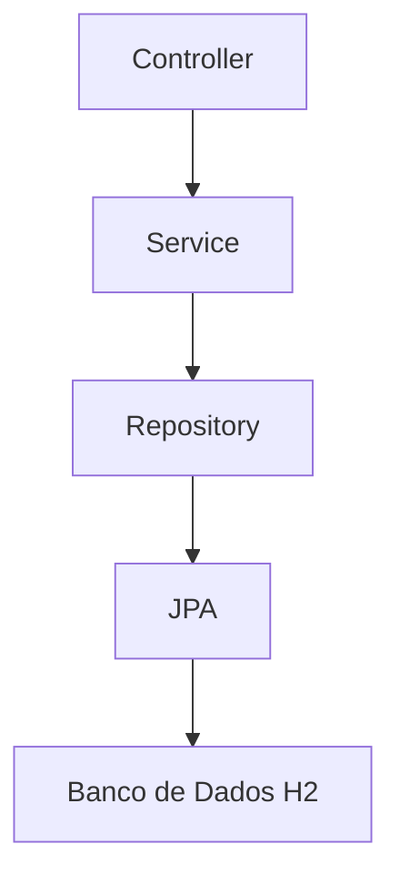
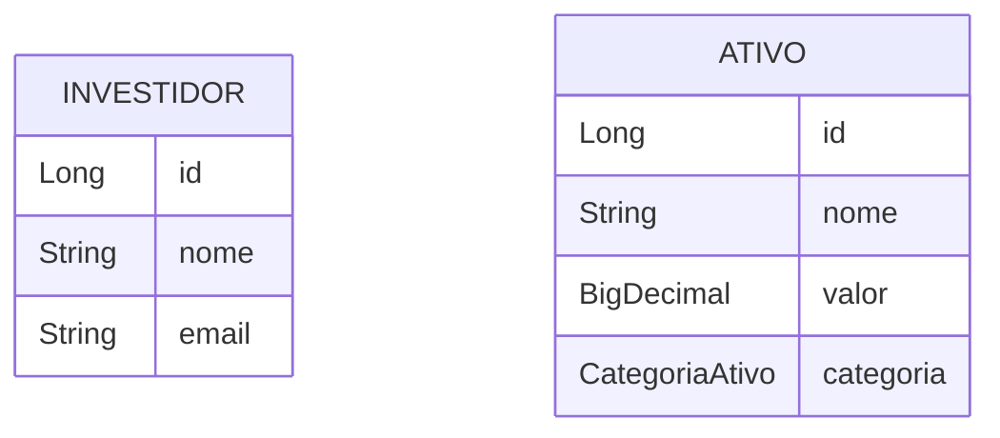

# AssessoriaInvestimentos

Este repositório contém um projeto **Java 17** com **Spring Boot**
desenvolvido por estudantes para o Challenge da FIAP juntamente à XP Invest. O objetivo é
implementar uma API REST simples para uma **assessoria de investimentos**,
permitindo cadastrar e gerenciar **investidores** e **ativos de
investimento**. A solução segue boas práticas básicas, com separação de
camadas (controller, service, repository) e utiliza um banco de dados
em memória (H2) para facilitar a execução.

# Alunos

- Geovanna Silva Cunha - RM 97736
- Gustavo Medeiros - RM 552093
- João Arthur Monteiro Pajaro - RM 551272
- Victor Camargo Maciel - RM 98384

## Descrição

O sistema expõe endpoints REST para as seguintes operações:

- **Investidores**: cadastro, listagem, consulta por id, atualização e
  exclusão de investidores.
- **Ativos**: cadastro, listagem, consulta por id, atualização e
  exclusão de ativos de investimento. As categorias de ativo são
  definidas pelo enum `CategoriaAtivo` (`RENDA_FIXA`, `RENDA_VARIAVEL`,
  `FUNDO` e `CRIPTO`).

Exemplos de uso:

- `GET /api/ativos` — lista todos os ativos cadastrados.
- `POST /api/investidores` — cadastra um novo investidor enviando JSON
  com `nome` e `email`.

Validações básicas são aplicadas através de anotações como
`@NotBlank` e `@NotNull`, e erros retornam respostas padronizadas.

## Como rodar

1. **Pré‑requisitos**: ter **Java 17** e **Maven** instalados.
2. Clonar ou baixar este repositório.
3. Na raiz do projeto, executar:
   ```bash
   mvn clean install
   mvn spring-boot:run
   ```
4. A API estará disponível em `http://localhost:8080`. Os endpoints
   começam por `/api/investidores` e `/api/ativos`.
5. Para visualizar o banco de dados H2 em memória, acesse
   `http://localhost:8080/h2-console` (usuário **sa**, senha em branco).

## Exemplos de requisições

### Cadastrar um investidor
```
POST /api/investidores
Content-Type: application/json

{
  "nome": "João da Silva",
  "email": "joao@exemplo.com"
}
```

### Cadastrar um ativo
```
POST /api/ativos
Content-Type: application/json

{
  "nome": "Tesouro Selic",
  "valor": 100.00,
  "categoria": "RENDA_FIXA"
}
```

## Tecnologias utilizadas

- **Java 17**
- **Spring Boot 3** (starter‑web, starter‑data‑jpa, starter‑validation)
- **Spring Data JPA**
- **H2 Database**

## Diagramas

### Camadas da aplicação



### Relacionamento de entidades

Neste projeto simples, as entidades **Investidor** e **Ativo** são
independentes: não existe um relacionamento direto entre elas, apenas
operações isoladas de CRUD. A seguir está um diagrama ER básico:


